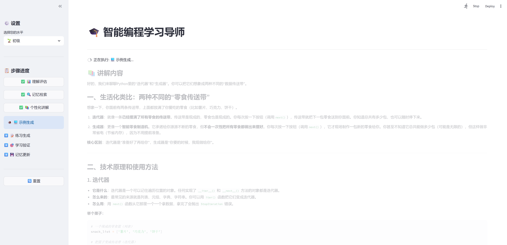
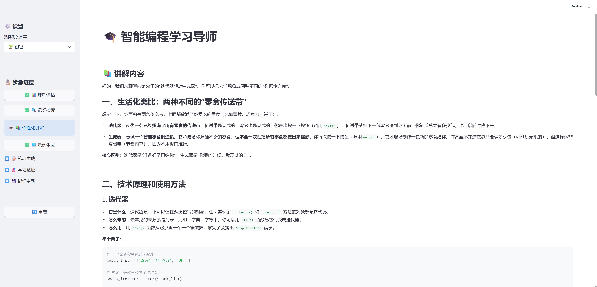

# 🎓 智能编程学习导师

一个基于 LangGraph 和 LLM 的智能编程学习系统，提供个性化的编程教学体验。




## ✨ 特性

- 🧠 **智能理解评估**：自动分析用户查询，识别学习需求
- 📚 **个性化讲解**：根据用户水平（初级/中级/高级）生成定制内容
- 💻 **代码示例生成**：提供实用的代码示例
- 📝 **智能练习**：生成针对性的练习题
- 🎯 **学习验证**：评估学习成果，提供反馈
- 💾 **记忆系统**：三层记忆架构，支持长期学习跟踪
- 🌐 **Web 界面**：基于 Streamlit 的现代化网页应用
- 📊 **分步执行**：每步完成后查看结果，支持历史步骤回顾

## 🚀 快速开始

### 环境要求

- Python 3.11+
- OpenAI API Key（或兼容的 API）

### 安装依赖

```bash
# 使用 pip
pip install -e .

# 或使用 uv
uv pip install -e .
```

### 配置环境变量

复制 `.env.example` 为 `.env` 并填入你的 API 密钥：

```bash
cp .env.example .env
```

编辑 `.env` 文件：

```env
OPENAI_API_KEY=your_api_key_here
OPENAI_BASE_URL=https://api.siliconflow.cn/v1
OPENAI_MODEL=deepseek-ai/DeepSeek-V3
```

## 🎮 使用方法

### 方式一：Web 界面（推荐）

启动 Streamlit 网页应用：

```bash
streamlit run app.py
```

然后在浏览器中打开 `http://localhost:8501`

### 方式二：命令行交互

```bash
python main.py
```

### 方式三：快速演示

```bash
python main.py quick
```

## 📁 项目结构

```
study_agent/
├── app.py                          # Streamlit Web 应用
├── main.py                         # 命令行入口
├── pyproject.toml                  # 项目配置
├── src/
│   ├── workflows/                  # 工作流编排
│   │   └── teaching_workflow.py   # 主教学工作流
│   ├── agents/                     # 功能 Agent
│   │   ├── base_agent.py          # Agent 基类
│   │   ├── understanding_agent.py # 理解评估 Agent
│   │   ├── memory_retrieval_agent.py # 记忆检索 Agent
│   │   ├── explanation_agent.py   # 个性化讲解 Agent
│   │   ├── example_generation_agent.py # 示例生成 Agent
│   │   ├── practice_generation_agent.py # 练习生成 Agent
│   │   ├── validation_agent.py    # 验证 Agent
│   │   └── memory_update_agent.py # 记忆更新 Agent
│   ├── tools/                      # 工具层
│   │   ├── code_execution_tool.py # 代码执行工具
│   │   ├── documentation_retrieval_tool.py # 文档检索工具
│   │   └── practice_evaluation_tool.py # 练习评估工具
│   └── memory/                     # 记忆系统
│       ├── memory_system.py       # 记忆系统统一接口
│       ├── sensory_memory.py      # 感觉记忆
│       ├── short_term_memory.py   # 短期记忆
│       └── long_term_memory.py    # 长期记忆
├── config/
│   └── prompts/                    # Agent 提示词配置
├── data/                           # 数据存储目录
└── tests/                          # 测试文件
```

## 🎯 教学工作流

```
用户查询
    ↓
📊 理解评估 → 🔍 记忆检索 → 📚 个性化讲解 → 💻 示例生成 → 📝 练习生成 → 🎯 学习验证 → 💾 记忆更新
    ↓                                                                 ↑
    └──────────────────── 条件路由（验证分数低时补充讲解）──────────────┘
```

## 🤖 核心 Agent

| Agent | 职责 |
|-------|------|
| UnderstandingAgent | 理解用户查询，评估学习需求，识别主题和关键词 |
| MemoryRetrievalAgent | 从记忆系统检索相关知识、学习进度、常见错误 |
| ExplanationAgent | 根据用户水平生成个性化讲解内容 |
| ExampleGenerationAgent | 生成教学代码示例 |
| PracticeGenerationAgent | 生成练习题（基础/进阶/高阶） |
| ValidationAgent | 验证学习成果，生成反馈，评估掌握程度 |
| MemoryUpdateAgent | 更新学习记忆，记录学习进度 |

## 💾 记忆系统

| 记忆类型 | 存储 | 用途 |
|---------|------|------|
| SensoryMemory | 内存 | 最近10轮对话上下文 |
| ShortTermMemory | JSON文件 | 最近7天学习会话 |
| LongTermMemory | JSON文件 | 知识点、学习历史、代码作品集 |

## 🔧 开发

### 直接使用工作流

```python
from src.workflows import TeachingWorkflow

# 创建工作流
workflow = TeachingWorkflow()

# 运行教学流程
result = workflow.run(
    user_query="什么是Python装饰器？",
    user_level="intermediate",
    workflow_id="demo_001",
)

print(result["explanation"])    # 讲解内容
print(result["example"])        # 示例代码
print(result["practice"])       # 练习题
print(result["validation"])     # 验证结果
```

### 运行测试

```bash
# 运行工作流测试
python tests/test_workflow.py

# 或使用 pytest
pytest tests/test_workflow.py -v
```

## 📄 许可证

MIT License

## 🤝 贡献

欢迎提交 Issue 和 Pull Request！

## 📧 联系方式

如有问题，请提交 Issue。
